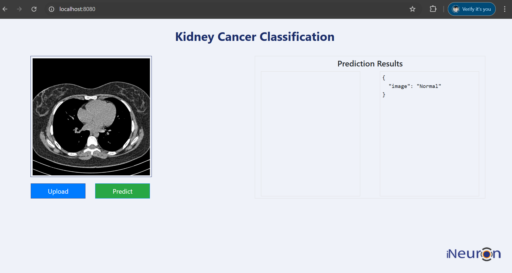

# End-to-End Kidney Cancer Classification using DVC



## Overview
This project implements an end-to-end chest cancer classification system using Deep Learning and DVC (Data Version Control). The system provides a web interface for uploading chest CT scans and obtaining cancer classification predictions.

## Project Structure

### Workflows
1. Update config.yaml
2. Update secrets.yaml [optional]
3. Update params.yaml
4. Update the entity
5. Update the configuration manager in src config
6. Update the components
7. Update the pipeline
8. Update the main.py
9. Update the dvc.yaml
10. app.py

## Installation and Setup

### Prerequisites
- Python 3.x
- Git
- Docker (for deployment)

### Local Development Setup

1. Clone the repository
```bash
git clone https://github.com/chetankharkar21/End-to-End-chest-classification-using-DVC.git
```

2. Create and activate virtual environment
```bash
# Create virtual environment
python -m venv venv_name

# For Windows PowerShell
Set-ExecutionPolicy -ExecutionPolicy RemoteSigned -Scope Process
.\venv_name\Scripts\Activate

# For Linux/Mac
source venv_name/bin/activate
```

3. Install dependencies
```bash
pip install -r requirements.txt
```

## MLflow Integration with DagsHub

### Configuration
Set the following environment variables:

```bash
# For Windows PowerShell
$env:MLFLOW_TRACKING_URI = "https://dagshub.com/chetankharkar21/End-to-End-chest-classification-using-DVC.mlflow"
$env:MLFLOW_TRACKING_USERNAME = "chetankharkar21"
$env:MLFLOW_TRACKING_PASSWORD = "4d6584b697c03a8d1f682a054efbee4a7264d047"
```

For more information about DagsHub integration, visit [DagsHub](https://dagshub.com/)

## AWS Deployment Guide

### Prerequisites
1. AWS Account
2. IAM User with appropriate permissions
3. GitHub Account

### Required AWS Permissions
- AmazonEC2ContainerRegistryFullAccess
- AmazonEC2FullAccess

### Deployment Steps

1. **Create IAM User for Deployment**
   - Configure with EC2 access
   - Configure with ECR (Elastic Container Registry) access

2. **Set Up ECR Repository**
   - Create repository to store Docker images
   - Note the URI: 977099021178.dkr.ecr.us-east-2.amazonaws.com/chest

3. **EC2 Setup**
   - Launch Ubuntu EC2 instance
   - Install Docker:
     ```bash
     sudo apt-get update -y
     sudo apt-get upgrade
     curl -fsSL https://get.docker.com -o get-docker.sh
     sudo sh get-docker.sh
     sudo usermod -aG docker ubuntu
     newgrp docker
     ```

4. **Configure GitHub Actions**
   - Set up EC2 as self-hosted runner
   - Navigate to repository Settings > Actions > Runners
   - Add new self-hosted runner
   - Follow the provided setup commands

5. **Configure GitHub Secrets**
   Set the following repository secrets:
   ```
   AWS_ACCESS_KEY_ID=[Your AWS Access Key]
   AWS_SECRET_ACCESS_KEY=[Your AWS Secret Key]
   AWS_REGION=us-east-2
   AWS_ECR_LOGIN_URI=977099021178.dkr.ecr.us-east-2.amazonaws.com
   ECR_REPOSITORY_NAME=chest
   ```

### Deployment Workflow
1. Build Docker image from source code
2. Push Docker image to ECR
3. Launch EC2 instance
4. Pull image from ECR to EC2
5. Launch Docker image on EC2

## Contributing
Please feel free to submit issues and pull requests.

